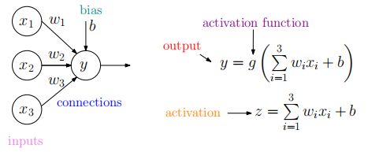
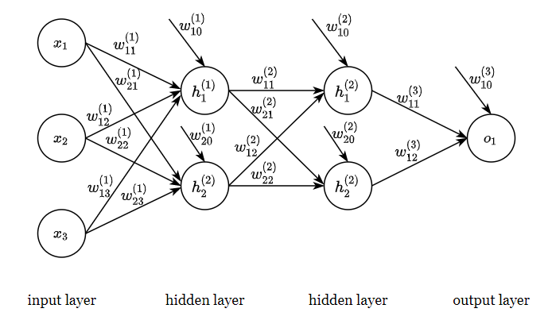

# FNN Derivation

## notation

## some common activation functions

1. sigmoid
   $$
   g(z)=\sigma(z)=\left(1+e^{-z}\right)^{-1}\\
   $$
   
2. tanh
   $$
   g(z)=\tanh (z)=\frac{e^{z}-e^{-z}}{e^{z}+e^{-z}}=2 \sigma(2 z)-1\\
   $$

3. ReLu

$$
g(z)=ReLu(z)=\max (0, z)\\
$$

## loss function

We will be using cross-entropy as our loss function:
$$
\ell_{c e}(y, t)=-t \log y-(1-t) \log (1-y),\\
~\\
\text{where $y$ is predicted value, $t$ is the target}\\
$$
This leads to the cost function:
$$
\mathcal{C}(\mathbf{W})=-\frac{1}{N} \sum_{i=1}^{N}(\underbrace{t^{(i)} \log f\left(\mathbf{x}^{(i)}, \mathbf{W}\right)+\left(1-t^{(i)}\right) \log \left(1-f\left(\mathbf{x}^{(i)}, \mathbf{W}\right)\right)}_{\ell_{c e}\left(f\left(\mathbf{x}^{(i)}, \mathbf{W}\right), t^{(i)}\right)})\\
$$
where $N$ is the size of dataset; $\left(\mathbf{x}^{(i)}, t^{(i)}\right)$ denotes the $i$th sample; $x^{(i)}$ is the feature vector, $t^{(i)}$ is the label or target.

We would like to train our model to minimize cost.

## gradient descend

We will minimize the cost using stochastic gradient descend (SGD). So only one sample is used to calculate cost in each iteration. We can denote this cost as:
$$
J(\mathbf{W})=\ell\left(f\left(\mathbf{x}^{(i)}, \mathbf{W}\right), t^{(i)}\right)\\
$$
During training, weights are updated using the following equation: 
$$
\mathbf{W}^{(t)}=\mathbf{W}^{(t-1)}-\alpha \nabla J\left(\mathbf{W}^{(t-1)}\right),\\
\text{where $\nabla J\left(\mathbf{W}^{(t-1)}\right)$ is the gradient of the cost function (i.e., the vector of the partial derivatives),}\\
\text{$\alpha>0$ is the learning rate, $t$ is the timestep.}\\
$$
The gradient $\nabla_{\mathbf{W}} \ell\left(f\left(\mathbf{x}^{(i)}, \mathbf{W}\right), t^{(i)}\right)$ is computed using a forward pass followed by a backward pass (back-propagation).

## forward pass

We use forward pass to calculate outputs of each layers, consider the following binary classification example with two hidden layers and one single-unit output layer:

1. outputs of the first hidden layer
   $$
   \left(\begin{array}{l}
   z_{1}^{(1)} \\
   z_{2}^{(1)}
   \end{array}\right)=\left(\begin{array}{llll}
   w_{10}^{(1)} & w_{11}^{(1)} & w_{12}^{(1)} & w_{13}^{(1)} \\
   w_{20}^{(1)} & w_{21}^{(1)} & w_{22}^{(1)} & w_{23}^{(1)}
   \end{array}\right)\left(\begin{array}{l}
   1 \\
   x_{1} \\
   x_{2} \\
   x_{3}
   \end{array}\right),\left(\begin{array}{l}
   h_{1}^{(1)} \\
   h_{2}^{(1)}
   \end{array}\right)=\left(\begin{array}{l}
   g\left(z_{1}^{(1)}\right) \\
   g\left(z_{2}^{(1)}\right)
   \end{array}\right)\\
   $$
   or we can write it in this form:
   $$
   \mathbf{z}^{(1)}=\mathbf{W}^{(1)}\left(\begin{array}{c}1 \\ \mathbf{x}\end{array}\right), \quad \mathbf{h}^{(1)}=g\left(\mathbf{z}^{(1)}\right)\\
   $$
   
2. outputs of the 2^nd^ hidden layer
   $$
   \left(\begin{array}{c}
   z_{1}^{(2)} \\
   z_{2}^{(2)}
   \end{array}\right)=\left(\begin{array}{lll}
   w_{10}^{(2)} & w_{11}^{(2)} & w_{12}^{(2)} \\
   w_{20}^{(2)} & w_{21}^{(2)} & w_{22}^{(2)}
   \end{array}\right)\left(\begin{array}{c}
   1 \\
   h_{1}^{(1)} \\
   h_{2}^{(1)}
   \end{array}\right), \quad\left(\begin{array}{l}
   h_{1}^{(2)} \\
   h_{2}^{(2)}
   \end{array}\right)=\left(\begin{array}{l}
   g\left(z_{1}^{(2)}\right) \\
   g\left(z_{2}^{(2)}\right)
   \end{array}\right)\\
   $$
   or:
   $$
   \mathbf{z}^{(2)}=\mathbf{W}^{(2)}\left(\begin{array}{c}1 \\ \mathbf{h}^{(1)}\end{array}\right), \quad \mathbf{h}^{(2)}=g\left(\mathbf{z}^{(2)}\right)\\
   $$
   
3. outputs of the output layer
   $$
   \left(\begin{array}{l}
   z_{1}^{(3)} \\
   
   \end{array}\right)=\left(\begin{array}{lll}
   w_{10}^{(3)} & w_{11}^{(3)} & w_{12}^{(3)} \\
   w_{20}^{(3)} & w_{21}^{(3)} & w_{22}^{(3)}
   \end{array}\right)\left(\begin{array}{c}
   1 \\
   h_{1}^{(2)} \\
   h_{2}^{(2)}
   \end{array}\right), \quad\left(\begin{array}{l}
   o_{1} \\
   
   \end{array}\right)=\left(\begin{array}{l}
   g\left(z_{1}^{(3)}\right) \\
   \end{array}\right)\\
   $$
   or:
   $$
   \mathbf{z}^{(3)}=\mathbf{W}^{(3)}\left(\begin{array}{c}1 \\ \mathbf{h}^{(2)}\end{array}\right), \quad \mathbf{y}=\sigma\left(\mathbf{z}^{(3)}\right)\\
   $$

## backward pass

Backward pass (also known as back-propagation) is the algorithm used to calculate gradient $\nabla J\left(\mathbf{W}\right)$ for weight update. In the below example, we show that in order to calculate the gradient of the first layer, $\nabla_{\mathbf{W}^{(1)}} J$, we need to find all the gradients below this layer, i.e. $\nabla_{\mathbf{W}^{(2)}} J$ and $\nabla_{\mathbf{W}^{(3)}} J$. This is the motivation of backward pass, meaning that we calculate gradient from the last layer to the first layer. consider the following binary classification example:

1. To calculate the gradient of the first hidden layer, $\nabla_{\mathbf{W}^{(1)}} J$:

- we have weights of the first hidden layer:

$$
\mathbf{W}^{(1)}=\left(\begin{array}{llll}
w_{10}^{(1)} & w_{11}^{(1)} & w_{12}^{(1)} & w_{13}^{(1)} \\
w_{20}^{(1)} & w_{21}^{(1)} & w_{22}^{(1)} & w_{23}^{(1)}
\end{array}\right)
$$

- the weights in $\mathbf{W}^{(1)}$ are only used to compute $\mathbf{z}^{(1)}=\left(\begin{array}{l}z_{1}^{(1)} \\ z_{2}^{(1)}\end{array}\right)$
- for each weight $w_{m n}^{(1)}$, to compute $\frac{\partial J}{\partial w_{m n}^{(1)}}$, we can apply the chain rule for partial derivatives, by treating $J$ as a function of $z_{1}^{(1)}$ and $z_{2}^{(1)}$, while $z_{1}^{(1)}$ and $z_{2}^{(1)}$ are treated as functions of $w_{m n}^{(1)}$ :

$$
\frac{\partial J}{\partial w_{m n}^{(1)}}=\frac{\partial J}{\partial z_{1}^{(1)}} \frac{\partial z_{1}^{(1)}}{\partial w_{m n}^{(1)}}+\frac{\partial J}{\partial z_{2}^{(1)}} \frac{\partial z_{2}^{(1)}}{\partial w_{m n}^{(1)}}\\
$$

$$
z_{1}^{(1)}=w_{10}^{(1)}+w_{11}^{(1)} x_{1}+w_{12}^{(1)} x_{2}+w_{13}^{(1)} x_{3} \\
z_{2}^{(1)}=w_{20}^{(1)}+w_{21}^{(1)} x_{1}+w_{22}^{(1)} x_{2}+w_{23}^{(1)} x_{3}\\
$$

$$
\begin{array}{c}
\frac{\partial J}{\partial w_{10}^{(1)}}=\frac{\partial J}{\partial z_{1}^{(1)}} \underbrace{\frac{\partial z_{1}^{(1)}}{\partial w_{10}^{(1)}}}_{=1}+\frac{\partial J}{\partial z_{2}^{(1)}} \underbrace{\frac{\partial z_{2}^{(1)}}{\partial w_{10}^{(1)}}}_{=0}, \quad \frac{\partial J}{\partial w_{11}^{(1)}}=\frac{\partial J}{\partial z_{1}^{(1)}} \underbrace{\frac{\partial z_{1}^{(1)}}{\partial w_{11}^{(1)}}}_{=x_{1}}+\frac{\partial J}{\partial z_{2}^{(1)}} \underbrace{\frac{\partial z_{2}^{(1)}}{\partial w_{11}^{(1)}}}_{=0}, 
\quad \frac{\partial J}{\partial w_{12}^{(1)}}=\frac{\partial J}{\partial z_{1}^{(1)}} \underbrace{\frac{\partial z_{1}^{(1)}}{\partial w_{12}^{(1)}}}_{=x_{2}}+\frac{\partial J}{\partial z_{2}^{(1)}} \underbrace{\frac{\partial z_{2}^{(1)}}{\partial w_{12}^{(1)}}}_{=0}, \quad \frac{\partial J}{\partial w_{13}^{(1)}}=\frac{\partial J}{\partial z_{1}^{(1)}} \underbrace{\frac{\partial z_{1}^{(1)}}{\partial w_{13}^{(1)}}}_{=x_{3}}+\frac{\partial J}{\partial z_{2}^{(1)}} \underbrace{\frac{\partial z_{2}^{(1)}}{\partial w_{13}^{(1)}}}_{=0}
\end{array}\\
$$

$$
\begin{array}{c}
\frac{\partial J}{\partial w_{20}^{(1)}}=\frac{\partial J}{\partial z_{1}^{(1)}} \underbrace{\frac{\partial z_{1}^{(1)}}{\partial w_{20}^{(1)}}}_{=0}+\frac{\partial J}{\partial z_{2}^{(1)}} \underbrace{\frac{\partial z_{2}^{(1)}}{\partial w_{20}^{(1)}}}_{=1}, \quad \frac{\partial J}{\partial w_{21}^{(1)}}=\frac{\partial J}{\partial z_{1}^{(1)}} \underbrace{\frac{\partial z_{1}^{(1)}}{\partial w_{21}^{(1)}}}_{=0}+\frac{\partial J}{\partial z_{2}^{(1)}} \underbrace{\frac{\partial z_{2}^{(1)}}{\partial w_{21}^{(1)}}}_{=x_{1}}, \quad 
\frac{\partial J}{\partial w_{22}^{(1)}}=\frac{\partial J}{\partial z_{1}^{(1)}} \underbrace{\frac{\partial z_{1}^{(1)}}{\partial w_{22}^{(1)}}}_{=0}+\frac{\partial J}{\partial z_{2}^{(1)}} \underbrace{\frac{\partial z_{2}^{(1)}}{\partial w_{22}^{(1)}}}_{=x_{2}}, \quad \frac{\partial J}{\partial w_{23}^{(1)}}=\frac{\partial J}{\partial z_{1}^{(1)}} \underbrace{\frac{\partial z_{1}^{(1)}}{\partial w_{23}^{(1)}}}_{=0}+\frac{\partial J}{\partial z_{2}^{(1)}} \underbrace{\frac{\partial z_{2}^{(1)}}{\partial w_{23}^{(1)}}}_{=x_{3}}
\end{array}\\
$$

- we conclude that
  $$
  \underbrace{\left(\begin{array}{llll}
  \frac{\partial J}{\partial w_{10}^{(1)}} & \frac{\partial J}{\partial w_{11}^{(1)}} & \frac{\partial J}{\partial w_{12}^{(1)}} & \frac{\partial J}{\partial w_{13}^{(1)}} \\
  \frac{\partial J}{\partial w_{20}^{(1)}} & \frac{\partial J}{\partial w_{21}^{(1)}} & \frac{\partial J}{\partial w_{22}^{(1)}} & \frac{\partial J}{\partial w_{23}^{(1)}}
  \end{array}\right)}_{\nabla_{\mathbf{w}^{(1)}} J}=\underbrace{\left(\begin{array}{l}
  \frac{\partial J}{\partial z_{1}^{(1)}} \\
  \frac{\partial J}{\partial z_{2}^{(1)}}
  \end{array}\right)}_{\nabla_{\mathbf{z}^{(1)}} J} \underbrace{\left.\begin{array}{llll}
  1 & x_{1} & x_{2} & x_{3}
  \end{array}\right)}_{\left(\begin{array}{lll}
  1 & \mathbf{x}^{T}
  \end{array}\right)}\\
  $$

$$
\nabla_{\mathbf{W}^{(1)}} J=\nabla_{\mathbf{z}^{(1)}} J \cdot\left(\begin{array}{ll}
1 & \mathbf{x}^{T}
\end{array}\right)\\
$$

2. To compute $\nabla_{z^{(1)}}J$

- from forward pass, we have

$$
\begin{array}{l}
z_{1}^{(2)}=w_{10}^{(2)}+w_{11}^{(2)} g\left(z_{1}^{(1)}\right)+w_{12}^{(2)} g\left(z_{2}^{(1)}\right) \\
z_{2}^{(2)}=w_{20}^{(2)}+w_{21}^{(2)} g\left(z_{1}^{(1)}\right)+w_{22}^{(2)} g\left(z_{2}^{(1)}\right)
\end{array}
$$

- treat $z^{(1)}=\left(\begin{array}{c}
  z_{1}^{(1)} \\
  z_{2}^{(1)}
  \end{array}\right)$ and $z^{(2)}=\left(\begin{array}{c}
  z_{1}^{(2)} \\
  z_{2}^{(2)}
  \end{array}\right)$, we have

$$
\underbrace{\left(\begin{array}{c}
\frac{\partial J}{\partial z_{1}^{(1)}} \\
\frac{\partial J}{\partial z_{2}^{(1)}}
\end{array}\right)}_{\nabla_{z}(1) J}=\left(\begin{array}{l}
\frac{\partial J}{\partial z_{1}^{(2)}} \frac{\partial z_{1}^{(2)}}{\partial z_{1}^{(1)}}+\frac{\partial J}{\partial z_{2}^{(2)}} \frac{\partial z_{2}^{(2)}}{\partial z_{1}^{(1)}} \\
\frac{\partial J}{\partial z_{1}^{(2)}} \frac{\partial z_{1}^{(2)}}{\partial z_{2}^{(1)}}+\frac{\partial J}{\partial z_{2}^{(2)}} \frac{\partial z_{2}^{(2)}}{\partial z_{2}^{(1)}}
\end{array}\right)=\left(\begin{array}{ll}
\frac{\partial z_{1}^{(2)}}{\partial z_{1}^{(1)}} & \frac{\partial z_{2}^{(2)}}{\partial z_{1}^{(1)}} \\
\frac{\partial z_{1}^{(2)}}{\partial z_{2}^{(1)}} & \frac{\partial z_{2}^{(2)}}{\partial z_{2}^{(1)}}
\end{array}\right) \underbrace{\left(\begin{array}{l}
\frac{\partial J}{\partial z_{1}^{(2)}} \\
\frac{\partial J}{\partial z_{2}^{(2)}}
\end{array}\right)}_{\nabla_{z}^{(2)} J}\\
$$

$$
\nabla_{\mathbf{z}^{(1)}} J=\left(\begin{array}{ll}
\frac{\partial z_{1}^{(2)}}{\partial z_{1}^{(1)}} & \frac{\partial z_{2}^{(2)}}{\partial z_{1}^{(1)}} \\
\frac{\partial z_{1}^{(2)}}{\partial z_{2}^{(1)}} & \frac{\partial z_{2}^{(2)}}{\partial z_{2}^{(1)}}
\end{array}\right)\left(\begin{array}{l}
\frac{\partial J}{\partial z_{1}^{(2)}} \\
\frac{\partial J}{\partial z_{2}^{(2)}}
\end{array}\right)=\left(\begin{array}{ll}
w_{11}^{(2)} g^{\prime}\left(z_{1}^{(1)}\right) & w_{21}^{(2)} g^{\prime}\left(z_{1}^{(1)}\right) \\
w_{12}^{(2)} g^{\prime}\left(z_{2}^{(1)}\right) & w_{22}^{(2)} g^{\prime}\left(z_{2}^{(1)}\right)
\end{array}\right)\left(\begin{array}{c}
\frac{\partial J}{\partial z_{1}^{(2)}} \\
\frac{\partial J}{\partial z_{2}^{(2)}}
\end{array}\right)\\
$$

- we conclude that

$$
\nabla_{\mathbf{z}^{(1)}} J=\left(\begin{array}{l}
g^{\prime}\left(z_{1}^{(1)}\right) \\
g^{\prime}\left(z_{2}^{(1)}\right)
\end{array}\right) \odot\left\{\overline{\mathbf{W}}^{(2)^{T}} \cdot \nabla_{\mathbf{z}^{(2)}} J\right\},\\
\quad\\
\text{where $\odot$ denotes the element-wise multiplication, and $\overline{\mathbf{W}}$ is the matrix without the first column.}\\
$$

3. To compute $\nabla_{z^{(2)}}J$, we follow the similar approach

- we have
  $$
  z^{(3)}=w_{10}^{(3)}+w_{11}^{(3)} g\left(z_{1}^{(2)}\right)+w_{12}^{(3)} g\left(z_{2}^{(2)}\right)\\
  $$

$$
\nabla_{\mathbf{z}^{(2)}} J=\left(\begin{array}{l}
\frac{\partial z^{(3)}}{\partial z_{1}^{(2)}} \\
\frac{\partial z^{(3)}}{\partial z_{2}^{(2)}}
\end{array}\right) \frac{\partial J}{\partial z^{(3)}}=\left(\begin{array}{l}
w_{11}^{(3)} g^{\prime}\left(z_{1}^{(2)}\right) \\
w_{12}^{(3)} g^{\prime}\left(z_{2}^{(2)}\right)
\end{array}\right) \frac{\partial J}{\partial z^{(3)}}\\
$$

- we conclude
  $$
  \nabla_{\mathbf{z}^{(2)}} J=\left(\begin{array}{c}
  g^{\prime}\left(z_{1}^{(2)}\right) \\
  g^{\prime}\left(z_{2}^{(2)}\right)
  \end{array}\right) \odot\left\{\overline{\mathbf{W}}^{(3)^{T}} \cdot \frac{\partial J}{\partial z^{(3)}}\right\}
  $$

4. To compute $\frac{\partial J}{\partial z^{(3)}}$

- since we are using sigmoid activation in output layer, therefore

$$
J(\mathbf{W})=\ell(y, t)=\ell\left(\sigma\left(z^{(3)}\right), t\right)\\
$$

$$
\frac{\partial J}{\partial z^{(3)}}=\frac{\partial \ell}{\partial y}\left(\sigma\left(z^{(3)}\right), t\right) \cdot \sigma^{\prime}\left(z^{(3)}\right)\\
$$

- we conclude 

$$
\frac{\partial J}{\partial z^{(3)}}=-t+\sigma\left(z^{(3)}\right)\\
$$

- now we find the $\nabla_{\mathbf{W}^{(1)}} J$ for the first layer, finding $\nabla_{\mathbf{W}^{(2)}} J$ and $\nabla_{\mathbf{W}^{(3)}} J$ will follow the similar approach.

5. To organize the above calculation with back-prop, the work flow would look something like this:

- in the last layer $d$, compute and store in memory:

$$
\begin{array}{c}
\frac{\partial J}{\partial z^{(d)}}=-t^{(i)}+\sigma\left(z^{(d)}\right),\\ 
\quad\\
\nabla_{\mathbf{W}^{(d)}} J=\frac{\partial J}{\partial z^{(d)}}\left(1 \quad \mathbf{h}^{(d-1)^{T}}\right), \\
\quad\\
\nabla_{\mathbf{z}^{(d-1)}} J=g^{\prime}\left(\mathbf{z}^{(d-1)}\right) \odot\left\{\overline{\mathbf{W}}^{(d)^{T}} \cdot \frac{\partial J}{\partial z^{(d)}}\right\}; 
\end{array}\\
$$

- for layer $j$ from $d-1$ down to 2, compute and store in memory:

$$
\nabla_{\mathbf{W}^{(j)}} J=\nabla_{\mathbf{z}^{(j)}} J \cdot\left(1 \mathbf{h}^{(j-1)^{T}}\right), \\
\quad\\
\nabla_{\mathbf{z}^{(j-1)}} J=g^{\prime}\left(\mathbf{z}^{(j-1)}\right) \odot\left\{\overline{\mathbf{W}}^{(j)^{T}} \cdot \nabla_{\mathbf{z}^{(j)}} J\right\};\\
$$

- for first layer, compute and store in memory:

$$
\nabla_{\mathbf{W}^{(1)}} J=\nabla_{\mathbf{z}^{(1)}} J \cdot\left(\begin{array}{ll}
1 & \mathbf{x}^{(i)^{T}}
\end{array}\right)\\
$$

## Contact

Email: ken1997528@hotmail.com

WeChat: 799557629

